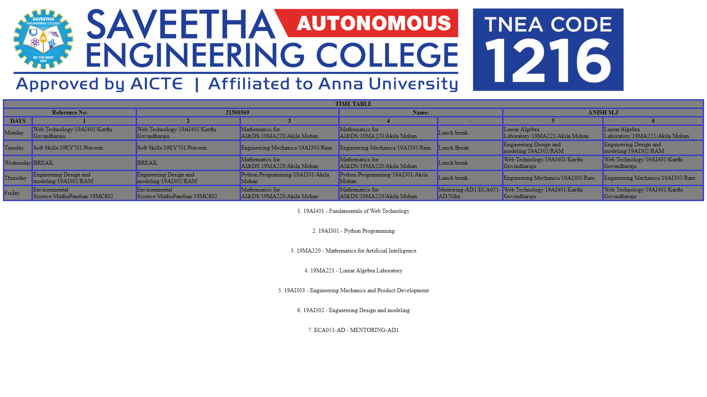

# Experiment_Time_Table

## AIM
To Write a html webpage page to display your timetable.

# ALGORITHM
### STEP 1
create a simple table using table tag
### STEP 2
Add header row using th tag
### STEP 3
Add your timetable
### STEP 4
Execute the program

# CODE
~~~
<!DOCTYPE html>
<html>

   <head>
      <title>TIME TABLE</title>
   </head>

   <body>
        </img>
      <table border = "1" cellspacing="1" bordercolor="blue" bgcolor="grey">
         <tr>
            <th colspan="8">TIME TABLE</th>
         </tr>
          <tr>
		<th colspan="2">Reference No:</th>
        	<th colspan="2">21500369</th>
		<th colspan="2">Name:</th>
		<th colspan="2">ANISH M.J</th>       
         <tr>
            <th>DAYS</th>
            <th>1</th>
            <th>2</th>
            <th>3</th>
             <th>4</th>
             <th>-</th>
            <th>5</th>
            <th>6</th>
           
         </tr>
       
 
  <tr>
             <td>Monday</td>
             <td>Web Technology/19AI401/Karthi Govindharaju</td>
             <td>Web Technology/19AI401/Karthi Govindharaju</td>
             <td>Mathematics for AI&DS/19MA220/Akila Mohan</td>
             <td>Mathematics for AI&DS/19MA220/Akila Mohan</td>
           <td>Lunch break</td>
             <td>Linear Algebra Laboratory/19MA221/Akila Mohan</td>
             <td>Linear Algebra Laboratory/19MA221/Akila Mohan</td>
</tr>
<tr>
             <td>Tuesday</td>
             <td>Soft Skills/19EY701/Praveen</td>
             <td>Soft Skills/19EY701/Praveen</td>
             <td>Engineering Mechanics/19AI303/Ram</td>
             <td>Engineering Mechanics/19AI303/Ram</td>
              <td>Lunch Break</td>
             <td>Engineering Design and modeling/19AI302/RAM</td>
             <td>Engineering Design and modeling/19AI302/RAM</td>
</tr>
<tr>
             <td>Wednesday</td>
             <td>BREAK</td>
             <td>BREAK</td>
             <td>Mathematics for AI&DS/19MA220/Akila Mohan</td>
             <td>Mathematics for AI&DS/19MA220/Akila Mohan</td>
             <td>Lunch break</td>
             <td>Web Technology/19AI401/Karthi Govindharaju</td>
             <td>Web Technology/19AI401/Karthi Govindharaju</td>
</tr>
  <tr>
             <td>Thursday</td>
             <td>Engineering Design and modeling/19AI302/RAM</td>
             <td>Engineering Design and modeling/19AI302/RAM</td>
             <td>Python Programming/19AI301/Akila Mohan</td>
             <td>Python Programming/19AI301/Akila Mohan</td>
             <td>Lunch break</td>
             <td>Engineering Mechanics/19AI303/Ram</td>
             <td>Engineering Mechanics/19AI303/Ram</td>
</tr>
<tr>
             <td>Friday</td>
             <td>Environmental Science/MuthuPandian/19MC802</td>
             <td>Environmental Science/MuthuPandian/19MC802</td>
             <td>Mathematics for AI&DS/19MA220/Akila Mohan</td>
             <td>Mathematics for AI&DS/19MA220/Akila Mohan</td>
              <td>Mentoring-AD1/ECA051-AD/Niha</td>
             <td>Web Technology/19AI401/Karthi Govindharaju</td>
             <td>Web Technology/19AI401/Karthi Govindharaju</td>
</tr>
 
        
      </table>
      
1. 19AI401 - Fundamentals of Web Technology
 
     
2. 19AI301 - Python Programming
 
     
3. 19MA220 - Mathematics for Artificial Intelligence
 
     
4. 19MA221 - Linear Algebra Laboratory
 
     
5. 19AI303 - Engineering Mechanics and Product Development
 
     
6. 19AI302 - Engineering Design and modeling
 
     
7. ECA051-AD - MENTORING-AD1
 
      
   </body>
</html>
~~~
# OUTPUT

